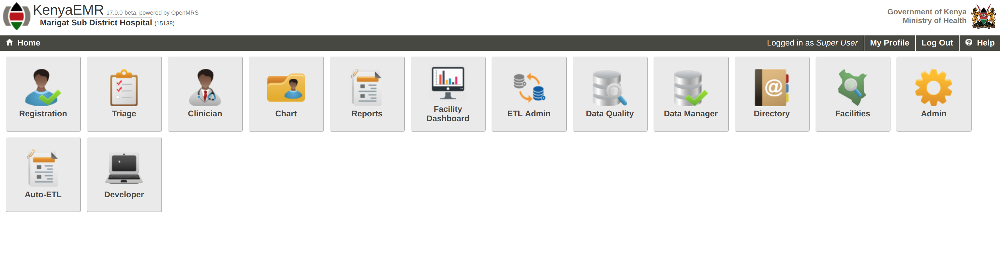

KenyaEMR Auto-ETL 

This module uses form metadata to generate SQL statements used to create ETL tables for reporting in KenyaEMR. 

Deployment
This is a KenyaEMR add-on module and requires a KenyaEMR environment.

Use

The module adds an app on home page labeled HTML to ETL  and the details are as shown in figure 1, figure 2, figure 3 and figure 4 below.

Figure 1: Auto-ETL’s HTML to ETL app in KenyaEMR

The page shows a list of forms with details about processed metadata. These include processed data points, DDL and DML SQL statements.

Figure 2: Auto-ETL output

Figure 3: DDL statement for a sample form

Figure 4: DML statement for a sample form

